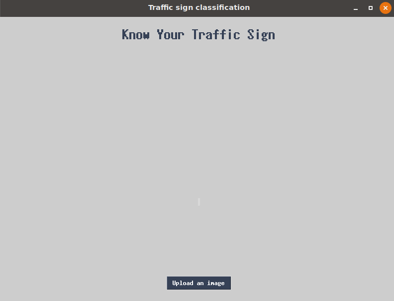
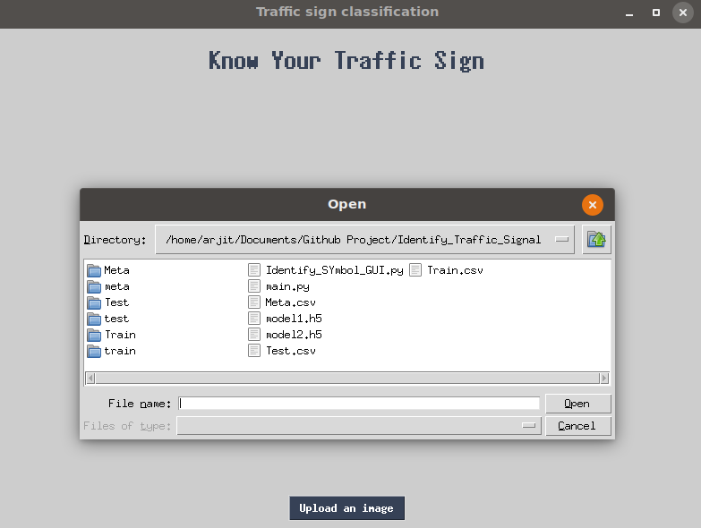
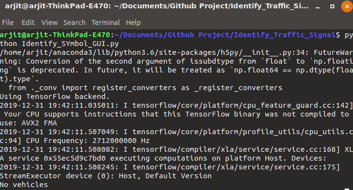

# Traffic-Signal-Detect

## Dataset-Kaggle
The dataset contains more than 50,000 images of different traffic signs. It is further classified into 43 different classes. The dataset is quite varying, some of the classes have many images while some classes have few images. The size of the dataset is around 300 MB. The dataset has a train folder which contains images inside each class and a test folder which we will use for testing our model.

### Download Data
https://www.kaggle.com/meowmeowmeowmeowmeow/gtsrb-german-traffic-sign

## Packages and Libraries
```numpy, pandas, matplotlib, opencv, tensorflow, PIL,, sklearn, keras, tkinter```

## Compile
1. Train your model, ```python main.py```
2. You get two model, ```model1.h5``` and ```model2.h5```
3. Then run GUI to identify traffic signal, ```python Identify_SYmbol_GUI.py``` 

## Output
<!-- .element height="50%" width="50%" -->     

I had successfully classified the traffic signs classifier with 96.11% accuracy and also visualized how my model accuracy and loss changes with time, which is pretty good from a simple CNN model.

